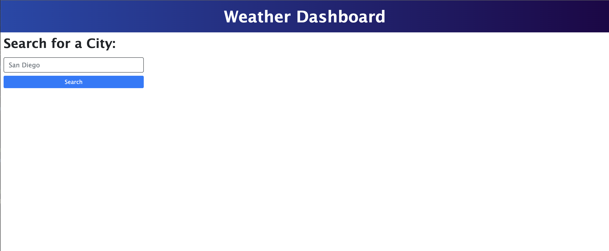
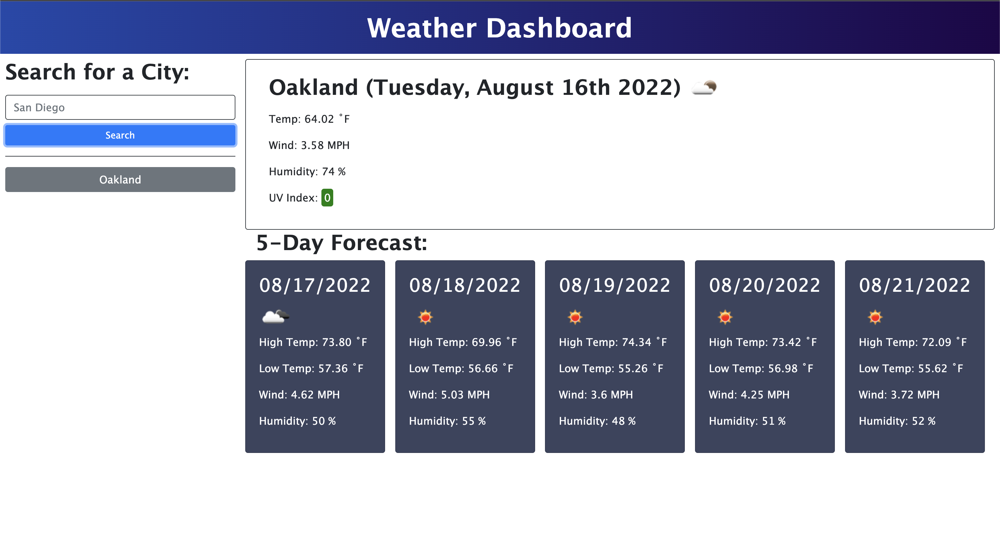
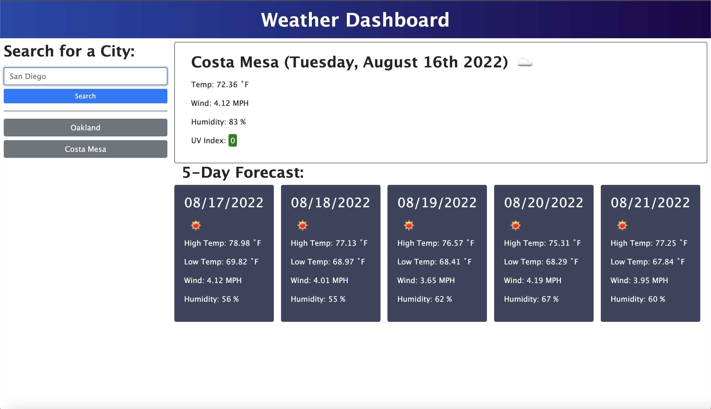
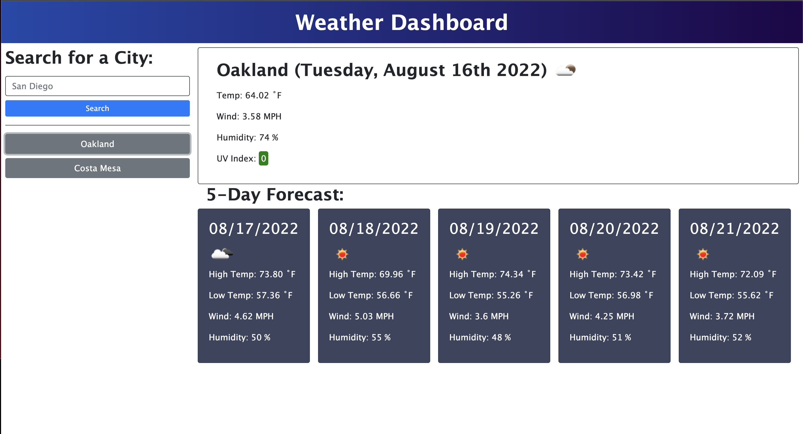

# A Breakdown of Simple Weather Dashboard Challenge

## Purpose of Week 1 Challenge: API Calls
This weeks challenge focused on making two API calls using the [OpenWeather One Call API](https://openweathermap.org/api/one-call-api). The web application is constructed so that a user can pass in a city name they want the current weather information for and the five day forecast information for.

Here is an image of what the web application looks like when first navigating to the page:

Once the user passes in a city name, regardless of how the user passes in the city, the first letter of each word will be capitalized once displaying the information. Then the first API call is made to get the latitude and longitude of the city we want weather data for. This latitude and longitude are then passed in as query parameters in the second API call that will give us the weather information we want to display to the user. Using Javascript, the application dynamically creates a card that displays the current day date, a weather icon, temperature, wind speed, humidity percentage, and UV index. The five day forecast is also dynamically created using mulitple cards for each of the next five days weather information. For each forecast card, the user is given the date, a weather icon, the high/low of that day's temperature, the wind speed and the humidity percentage. 

Here is an image to demonstrate what this display of information looks like for one city: 

A user has an option to search for multiple cities: 

For each city that is searched by the user, a button is created for that city and stored on the left side of the web application, under the search area. The data for each city is saved in local storage and retrieved/re-displayed, if a user clicks on that button. 

In the image below, the user first searched for Oakland, then Costa Mesa weather. However, the user is able to re-click on the Oakland button that was created to re-retrieve Oakland weather information. 

## Link to Simple Weather Dashboard
[Simple Weather Dashboard](https://savannahfausto.github.io/Fausto_Simple_Weather_Dashboard/)

